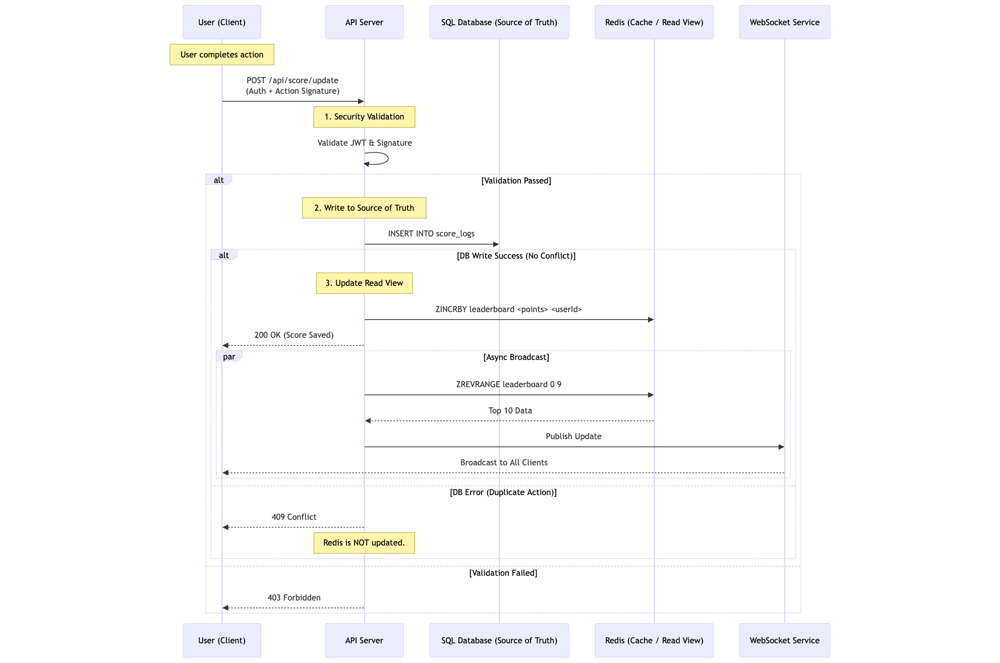

# Live Scoreboard Module



## Overview

This module handles secure score ingestion and real-time leaderboard broadcasting. It implements a **CQRS (Command Query Responsibility Segregation)** pattern where:

1. **Writes** are committed to a persistent SQL database (Source of Truth) to ensure data integrity and auditability.
2. **Reads** are served exclusively from Redis (Sorted Sets) to ensure sub-millisecond latency and high concurrency.

## Tech Stack

* **System of Record:** PostgreSQL (Persistence & History).
* **Read Layer:** Redis (Sorted Sets for Ranking).
* **Transport:** REST (Ingestion), WebSockets (Broadcasting).
* **Auth:** JWT (User Identity).

## API Specifications

### 1. Score Ingestion

**Endpoint:** `POST /api/score/update`
**Headers:** `Authorization: Bearer <JWT>`

**Payload:**

```json
{
  "actionId": "uuid-v4",
  "actionSignature": "hmac_sha256_string",
  "points": 100
}
```

**Execution Logic:**

1. **Security Check:** Verify JWT validity and validate `actionSignature` (HMAC) to prevent request tampering or replay attacks.
2. **Persistence (Source of Truth):**
* Insert a record into the SQL `score_logs` table.
* **Crucial:** Rely on the SQL `UNIQUE(user_id, action_id)` constraint. If this insert fails (e.g., user clicked twice), return `409 Conflict` and **stop**.


3. **Cache Update:**
* *Only if Step 2 is successful*: Execute `ZINCRBY global_leaderboard <points> <userId>` in Redis.


4. **Broadcast:** Trigger the WebSocket service to fetch the new Top 10 and push to clients.

### 2. Live Leaderboard Stream

**Protocol:** WebSocket / Server-Sent Events (SSE)
**Channel:** `public:leaderboard`

**Payload (Broadcasted on Change):**

```json
{
  "timestamp": 1704529000,
  "top_10": [
    {"rank": 1, "username": "playerOne", "score": 5000},
    {"rank": 2, "username": "playerTwo", "score": 4850}
    // ... up to 10
  ]
}
```

## Database Schema (SQL)

The schema is designed to enforce idempotency (preventing double submissions).

```sql
CREATE TABLE score_logs (
    id UUID PRIMARY KEY,
    user_id UUID NOT NULL,
    action_id UUID NOT NULL,
    points INT NOT NULL,
    created_at TIMESTAMP DEFAULT NOW(),
    -- Ensures a user cannot be credited for the same action twice
    CONSTRAINT unique_action_per_user UNIQUE (user_id, action_id)
);
```

## Security Implementation

* **Rate Limiting:** Implement a sliding window limiter (e.g., 10 requests/minute) to prevent abuse.
* **Action Signing:** The client must sign the request payload using a pre-shared secret or a server-provided nonce.
* **Input Validation:** Sanitize `points` inputs to prevent integer overflows or negative values.

---

### 3. Comments for Improvement

* **Reconciliation Worker:** To handle rare edge cases where the server crashes *after* writing to SQL but *before* updating Redis, implement a nightly cron job. This job should sum the SQL logs and overwrite the Redis leaderboard (`ZADD`) to ensure eventual consistency.
* **Broadcast Throttling:** Under high load, broadcasting on every single update is wasteful. Implement a "debounce" mechanism to broadcast the leaderboard state at most once every 500ms-1000ms.
* **Optimistic UI:** The frontend should instantly update the user's score visually upon action completion. If the API returns a `409` or `500` error, the frontend must rollback the score and display a "Network Error" toast.
